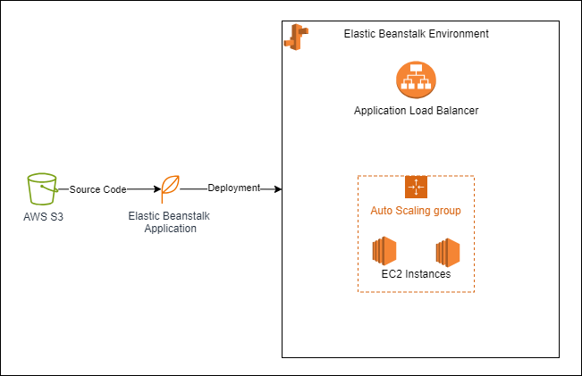
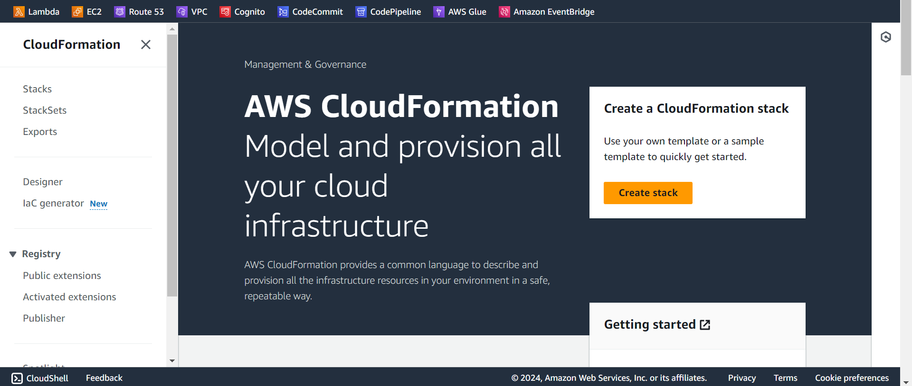
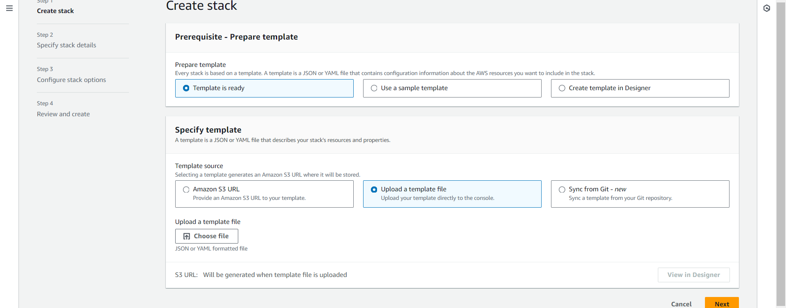
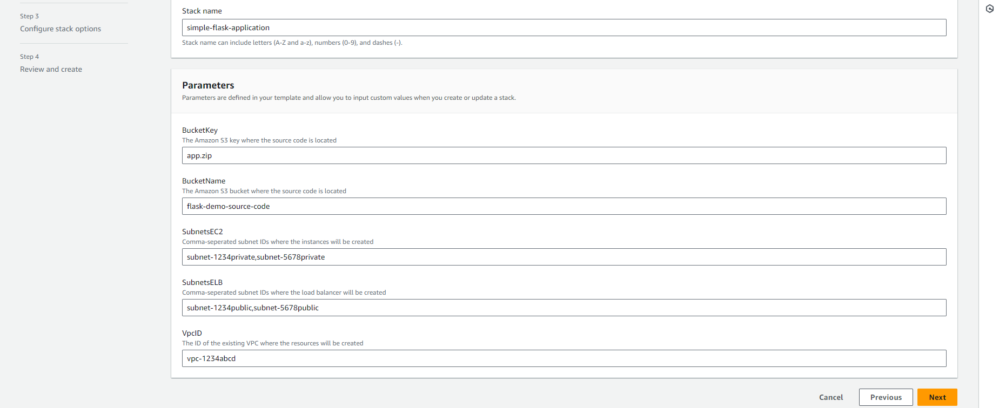
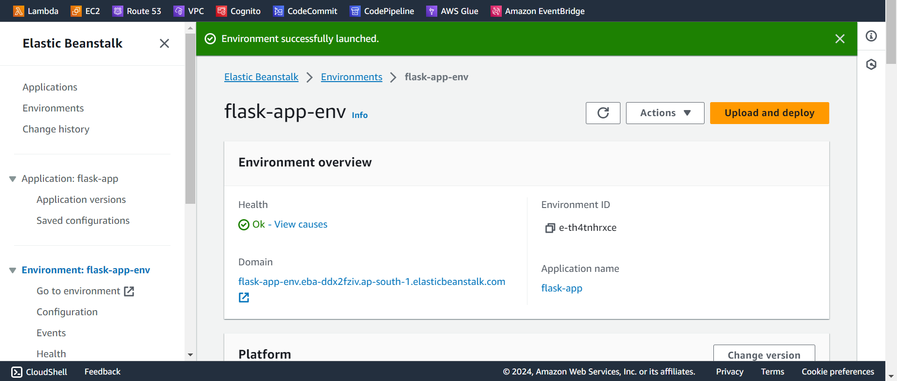
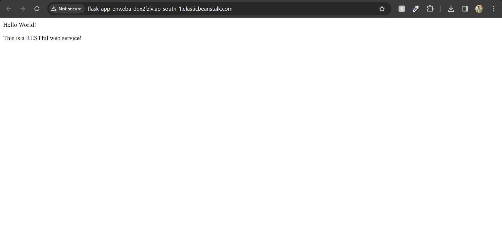
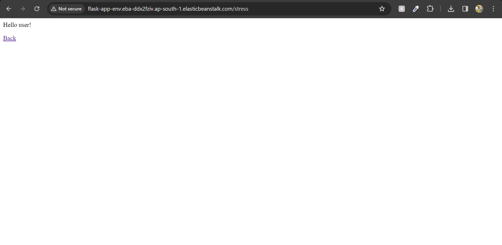

# **elasticbeanstalk-cloudformation**

This repository aims to deploy a simple web-app built using flask in AWS Elastic Beanstalk using Cloudformation template.

## **Prerequisites**

- Having a public S3 bucket that will be used to store the source code of the application as a zip.
- A VPC network with at least two public and two private subnets spanning across at least two availability zones.

## **Architecture**

The architecture diagram here represents the components that are utilized on AWS to make this application work. The components and their roles are as follows:
- A public AWS S3 (prerequisite) bucket where the source code of the application is stored in a zip format.
- An Elastic Beanstalk application is created and the code stored in S3 is used to create a version of this application.
- The application is deployed in an Elastic Beanstalk environment. The environment utilizes the following component:
  - A set of private EC2 instances that are used as backend to store the application.
  - An AutoScaling Group with the following configuration:
    - Minimum instances: 2
    - Maximum instances: 4
    - Scale in and scale out policies to add 1 instance when CPU utilization exceeds 80% for a period of 5 minutes and remove 1 instance when CPU utilization drops below 30%
  - A public Application Load Balancer that is utilized to expose the application to public.

## **Steps to Deploy**

Follow the following steps to deploy the application:
1. Upload the application zip file (app.zip) present in this repo to the S3 bucket.  
2. Go to the AWS console and search for Cloudformation and click on Create Stack.  
    

 
3. Upload the template file (template.yaml) present in this repository and click on next.   
    

 
4. Provide a stack name and then provide values for the parameters. The parameters are as follows:
    - BucketKey: It is path to the source code file in the S3 bucket.
    - BucketName: It is the name of the S3 bucket where source code is present as zip.
    - SubnetsEC2: A comma-seperated string of subnet IDs where instances will be created. It is recommended to provide at least two private subnets in different availability zones.
    - SubnetsELB: A comma-seperated string of subnet IDs where application load balancer will be created. It is required to give at least two public subnets in different availability zones.
    - VpcID: It is the id of the VPC where resources are to be provisioned.   
    

 
5. Provide any common tags, if required, and leave other options as defaults and then create the stack. Wait for a few minutes for the stack to be deployed. Once the stack deployment is completed, navigate to elastic beanstalk environment. You will se a similar output.  
    

 
6. Click on the domain and you will be greeted with the application homepage. The application also exposes an endpoint /stress that greets with another message.  
    

 
    

## **Cleanup**

Go to the cloudformation stacks and then delete the stack that was created in the above steps. All provisioned resources will be deleted once the stack deletion completes.